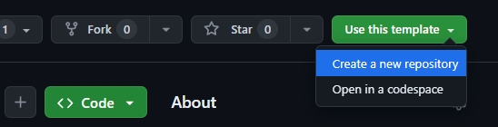
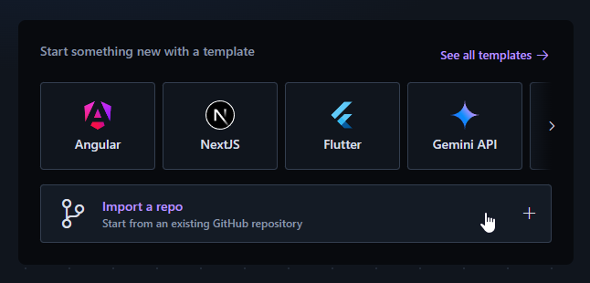

# Symfony Webapp Template

Use this template repository to create a new IDX project.

## Usage

- Go to [IDX Symfony Webapp Template](https://github.com/hamaryuginh/idx-symfony-webapp-template)

- Use this template to create a new repository

- Use your new repository to create a new project on IDX

- Have fun!

## IDX Project customizing

Get started by customizing your environment (defined in the .idx/dev.nix file) with the tools and IDE extensions you'll need for your project!

Learn more at https://developers.google.com/idx/guides/customize-idx-env
